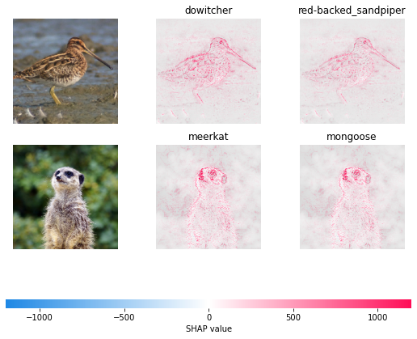

# 初始化模型


```python
import torch, torchvision
from torch import nn
from torchvision import transforms, models, datasets
import shap
import json
import numpy as np
mean = [0.485, 0.456, 0.406]
std = [0.229, 0.224, 0.225]

def normalize(image):
    if image.max() > 1:
        image /= 255
    image = (image - mean) / std
    # in addition, roll the axis so that they suit pytorch
    return torch.tensor(image.swapaxes(-1, 1).swapaxes(2, 3)).float()
# load the model
model = models.vgg16(pretrained=True).eval()

X,y = shap.datasets.imagenet50()

X /= 255

to_explain = X[[39, 41]]

# load the ImageNet class names
url = "https://s3.amazonaws.com/deep-learning-models/image-models/imagenet_class_index.json"
fname = shap.datasets.cache(url)
with open(fname) as f:
    class_names = json.load(f)
class_names0 = [s[1] for s in class_names.values()]
```

## 打印模型信息


```python
print(type(model.features[7]))
print(model.features[7])
print(to_explain.shape)
```

# shap.GradientExplainer


```python
e = shap.GradientExplainer((model, model.features[7]), normalize(X))# , local_smoothing=0.5
shap_values,indexes = e.shap_values(normalize(to_explain), ranked_outputs=2, nsamples=200)

# get the names for the classes
index_names = np.vectorize(lambda x: class_names[str(x)][1])(indexes)

# plot the explanations
shap_values = [np.swapaxes(np.swapaxes(s, 2, 3), 1, -1) for s in shap_values]

shap.image_plot(shap_values, to_explain, index_names)
```


    

    


# shap.DeepExplainer


```python
background = X[0:39]
print(background.shape)

e = shap.DeepExplainer((model, model.features[7]), normalize(background))
shap_values,indexes = e.shap_values(normalize(to_explain), ranked_outputs=2)
shap_values = [np.swapaxes(np.swapaxes(s, 2, 3), 1, -1) for s in shap_values]
print(shap_values[0].shape)
index_names = np.vectorize(lambda x: class_names[str(x)][1])(indexes)
shap.image_plot(shap_values, to_explain, index_names)
```

    (39, 224, 224, 3)
    

    Using a non-full backward hook when the forward contains multiple autograd Nodes is deprecated and will be removed in future versions. This hook will be missing some grad_input. Please use register_full_backward_hook to get the documented behavior.
    

    (2, 224, 224, 3)
    


    

    


# shap.Explainer


```python
# python function to get model output; replace this function with your own model function. 

def f(x):
    tmp = x.copy()
    return model(normalize(tmp))
print(fname)

with torch.no_grad():
    model = models.vgg16(pretrained=True).eval()

    # define a masker that is used to mask out partitions of the input image. 
    masker = shap.maskers.Image("inpaint_telea", X[0].shape)
    # masker_blur = shap.maskers.Image("blur(128,128)", X[0].shape)

    # create an explainer with model and image masker 
    explainer = shap.Explainer(f, masker, output_names=class_names0)#

    # here we explain two images using 500 evaluations of the underlying model to estimate the SHAP values
    shap_values = explainer(X[39,41], max_evals=100, batch_size=50, outputs=shap.Explanation.argsort.flip[:2]) 
    # output with shap values
    shap.image_plot(shap_values)
```

    C:\Users\HP\AppData\Roaming\Python\Python38\site-packages\shap\cached_data\imagenet_class_index.json
    


      0%|          | 0/48 [00:00<?, ?it/s]


    Partition explainer:  50%|███████████████████████████████████▌                                   | 1/2 [00:00<?, ?it/s]


      0%|          | 0/48 [00:00<?, ?it/s]


    Partition explainer: 3it [00:19,  9.87s/it]                                                                            
    

    (2, 224, 224, 3, 2)
    


    

    

